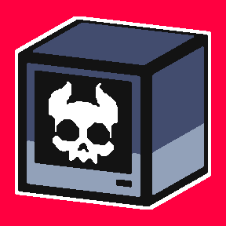

# CCBridge

A desktop control center for ComputerCraft turtles, written in C++.

The idea is to bridge and control CC:Tweaked turtles in a way that's easier for non‑technical users to manage.  
Also, it's a cool side‑project to work on.


---

## Current Status

**Early stage** - most systems are still experimental and subject to major changes.

Right now the focus is on:
- solidifying the communication layer between C++ and turtles,
- building out the core UI panels,
- and establishing the 3D world visualization system.

## For Developers

This repository is currently meant as a code showcase rather than a ready‑to‑use tool.  
To get things running you'll need Raylib set up locally, plus a ComputerCraft environment to connect turtles from. Setup instructions will improve as things mature.

**Minecraft Version Info:** CC:Tweaked 1.119.0 for Minecraft 1.21.1 (NeoForge).  
Other versions may work but aren't tested yet

## Building (rough around the edges)

If you want to try building it yourself:

```bash
git clone https://github.com/Nepoun/CCBridge.git
cd CCBridge
./BuildAndRun.bat
```

You'll need CMake 3.20+, a C++20 compiler, and all dependencies from the Tech Stack. I haven't packaged them all yet (missing raylib), so for now you'll have to install them manually. Proper build docs are on the way once the project stabilizes.

## Features

**Communication**  
WebSocket server, turtle control, registration/unregistration, real‑time state updates, command queue.

**Interface**  
Dockable window layout, turtle list with online/offline indicators, debug and profiler panel.

**Planned**  
- [ ] Turtle details & inventory panels
- [ ] 3D world viewport
- [ ] Block map from exploration data
- [ ] Minecraft texture & model loading
- [ ] Mod support
- [ ] Lua script sync

*Checklists get ticked as features land!*

## Roadmap

What's already working:

- [x] WebSocket communication backbone
- [x] Basic turtle registration and status tracking
- [x] Dockable UI framework (panels, tabs)
- [x] Debug & profiler panel

Coming next:

- [ ] 3D rendering viewport
- [ ] Inventory panel and item details
- [ ] Lua script sync
- [ ] Full GPS auto‑setup integration

## Lua Scripts

All ComputerCraft scripts live under `assets/lua/`.  
A description of each one is in [assets/lua/README.md](assets/lua/README.md).

## Future Plans

Eventually I'll set up a **Turtle Core Script** that can configure everything from a single `pastebin get` command, but that's on the back burner for now. I'll also open‑source everything under a permissive license once the core systems stop shifting every week.

## Tech Stack

`C++20` · `Raylib` · `Dear ImGui` · `rlImGui` · `Crow` · `Asio` · `nlohmann/json`

## Goals

- Remove the need to ever open the turtle terminal for monitoring, debugging, or scripting.
- Load textures and models directly from a local `.minecraft` installation.
- Support CC:Tweaked addons.
- Be usable by both programmers and non‑programmers.

---

## Screenshot

*I'll drop a proper UI screenshot here once the interface stops changing every other day. For now, you'll have to take my word that it exists.*