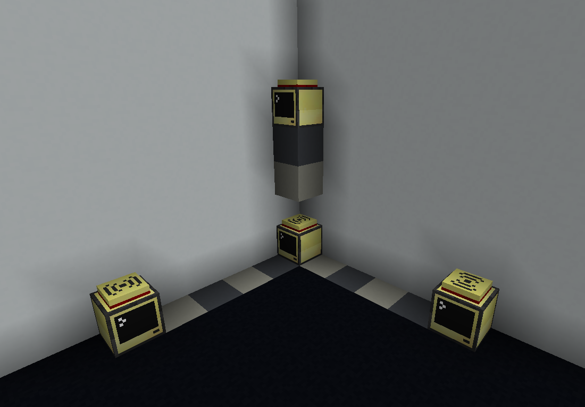

# Lua Scripts

These scripts are meant to be dropped on your turtles. You can run them by name, but I highly recommend renaming them to `startup.lua` since they're designed to run on startup.

Here's a quick overview of each one.

- **simple_controllable_turtle.lua**  
  Basic controllable turtle. Equip it with a wireless modem to see coordinates. It accepts commands from the terminal and (eventually) will also scout and save terrain for you.

- **auto_gps_turtle.lua**  
  Lets a turtle automatically set up a GPS constellation, provided you give it the right items and enough clear space. **You must equip a pickaxe, otherwise it won't work.**  
  I recommend placing the turtle on the border of a chunk, facing inward since GPS works better when contained in a single chunk.

- **simple_gps_setup.lua**  
  Standalone GPS host setup. Use this if you prefer to build the constellation manually.

Every GPS host computer needs to run `simple_gps_setup` (unless you're using `auto_gps_turtle`). For more details, check the official guide:  
https://tweaked.cc/guide/gps_setup.html

If you're building the constellation yourself, the layout should look like this:

